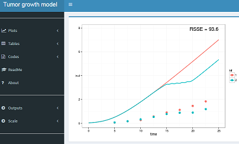

# UI

## Live Shiny Pharma Examples

- [Build your PK model by Marc Lavielle using the mlxR package at http://simulx.webpopix.org/ ](http://shiny.webpopix.org/dashboard/pkmodel/) & [here](http://webpopix.org/shiny/ShinyExamples.html)
- [medplot by Crt Ahlin & Lara Lusa to  facilitate the exploration and analysis of longitudinal data](http://shiny.mf.uni-lj.si/medplot/)
- [Bioequivalence v0.3 by Andrey Ogurtsov](https://statist.shinyapps.io/bioeq_en/)

   
 

## Shiny
- A Shiny application provides an attractive and useful user interface for end user interactivity. Shiny helps you turn your analyses into interactive web applications without requiring HTML, CSS, or JavaScript knowledge
- https://www.ncbi.nlm.nih.gov/pmc/articles/PMC4394611/

## Shiny UI
- Most Shiny applications are built using R code, using functions like fluidPage(), div(), and so on
- https://shiny.rstudio.com/articles/layout-guide.html
- https://shiny.rstudio.com/tutorial/written-tutorial/lesson2/
- https://bookdown.org/weicheng/shinyTutorial/ui.html

## HTML

- http://shiny.rstudio.com/articles/html-tags.html
- https://shiny.rstudio.com/articles/html-ui.html

## CSS 

- https://shiny.rstudio.com/articles/css.html
- http://bambooanalytics.co/blogs/howTo/shinystyle.html
- https://github.com/funjo/NYPD_accidents_shiny

## shinythemes

- https://rstudio.github.io/shinythemes/

## JS
- https://shiny.rstudio.com/articles/packaging-javascript.html

## shinydashboard

- http://webpopix.org/shiny/ShinyExamples.html
- https://github.com/nik01010/dashboardthemes
- https://divadnojnarg.github.io/blog/awesomedashboards/
- https://db.rstudio.com/best-practices/dashboards/

## shinydashobard information 

- [How to develop a Shiny dashboard](http://db.rstudio.com/best-practices/dashboards/)
- [Intro to dashboards](https://github.com/rstudio/bigdataclass2018/blob/master/assets/workbook/09-dashboards.Rmd)
- [CDC PrEP Guidelines](https://prism.shinyapps.io/cdc-prep-guidelines/)
- [CDC Zika Data](https://chendaniely.shinyapps.io/zika_cdc_dashboard/)
- [shinydashboard](https://rstudio.github.io/shinydashboard/)
- [Material design in Shiny apps](https://ericrayanderson.github.io/shinymaterial/)
- https://www.rstudio.com/resources/videos/dashboards-made-easy/

## flexdashboard

- [flexdashboard](http://rmarkdown.rstudio.com/flexdashboard/)
- [Gene Expression Biclustering - Bryan Lewis](https://jjallaire.shinyapps.io/shiny-biclust/)
- [Iris K-Means Clustering](https://jjallaire.shinyapps.io/shiny-kmeans/)

## shinymaterial
- https://ericrayanderson.github.io/shinymaterial/
- https://cran.r-project.org/web/packages/shinymaterial/index.html
- [The Development of Population Pharmacokinetic Model and a R Shiny App for CSL689 in Subjects with FVII Deficiency](http://www.go-acop.org/assets/ACOP9/documents/ACoP9%20Poster%20Schedule%20and%20List_Final.pdf)

## Other Packages
- shiny.semantic

## Iframes
- https://shiny.rstudio.com/
- https://bookdown.org/yihui/bookdown/web-pages-and-shiny-apps.html

## HTML Templates
- https://js-tutorial.shinyapps.io/dashboardApp/
- https://shiny.rstudio.com/articles/js-build-widget.html
- [HTML Templates](http://shiny.rstudio.com/articles/templates.html)
- [Developing and deploying large scale Shiny applications ](https://channel9.msdn.com/Events/useR-international-R-User-conferences/useR-International-R-User-2017-Conference/Developing-and-deploying-large-scale-Shiny-applications-for-non-life-insurance)

## Other details

- https://shiny.rstudio.com/articles/progress.html
- https://shiny.rstudio.com/gallery/progress-bar-example.html
- https://deanattali.com/blog/advanced-shiny-tips/
- https://stevenmortimer.com/tips-for-making-professional-shiny-apps-with-r/

## Shiny Modules
- https://shiny.rstudio.com/articles/js-dashboard.html
- https://rstudio.github.io/promises/articles/casestudy.html
- https://shiny.rstudio.com/articles/modules.html

# Deployment

## Run Locally (Dev Mode)

- https://shiny.rstudio.com/articles/deployment-local.html

## Package
- https://shiny.rstudio.com/articles/deployment-local.html
- https://github.com/crtahlin/medplot
- runGitHub("medplot", "crtahlin", subdir = "inst/shinyapp_symptoms2")
- https://www.ncbi.nlm.nih.gov/pmc/articles/PMC4383594/
- library(medplot) medplotOnline()
- https://github.com/xtmgah/DDCV
- https://arxiv.org/pdf/1404.0734.pdf
- https://will-landau.com/2016/11/01/appPackage/
- https://cran.r-project.org/web/packages/adepro/index.html

## Applications in Research - Modeling
- https://www.ncbi.nlm.nih.gov/pubmed/25733352

## Github
- https://github.com/rstudio/shiny_example

## Deploy as a Package/Shiny Gadget
- https://www.r-statistics.com/2016/11/ggedit-interactive-ggplot-aesthetic-and-theme-editor/
- [Shiny Gadgets](https://github.com/philbowsher/RStudio-Addins-Shiny-Gadgets)
- https://github.com/calligross/ggthemeassist
- https://will-landau.com/2016/11/01/appPackage/
- https://github.com/dreamRs/esquisse

## So where can I deploy my Shiny app
- shinyapps.io
- Shiny Server
- RStudio Connect beta.rstudioconnect.com

## Shiny Server OS
- https://www.rstudio.com/products/shiny/download-server/

## Shiny Server Pro
- https://www.rstudio.com/products/shiny-server-pro/

## RStudio Connect
- https://www.rstudio.com/products/connect/

## shiny Package & Shiny Server

<table width="100%" style="border-spacing: 50px; border-collapse: separate; margin: -50px auto;">
<tr>
<td style="vertical-align: top; padding-top: 1em">
### shiny Package
Shiny is an open source R package that provides a web framework for building interactive web applications using R.
</td>
<td></td>
</tr><tr>
<td style="vertical-align: top; padding-top: 1em">
### Shiny Server
Shiny Server is a server program that lets you host and manage shiny web applications and interactive documents online.
</td>
<td></td>
</tr>
</table>

## Come see us at the RStudio Conference...

- [Austin January 15th through the 18th 2019](https://www.rstudio.com/conference/)
- https://github.com/rstudio/rstudio-conf/tree/master/2018

</a>

